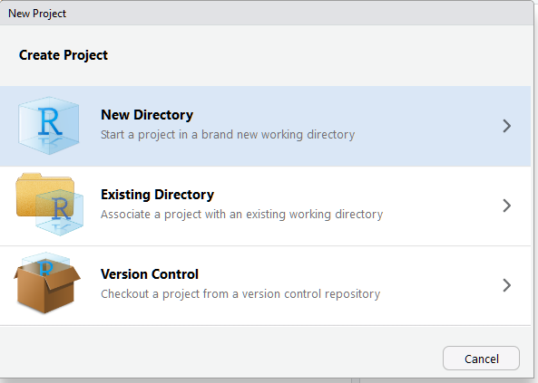

name: slide02
class: spaced 

```{r, include=FALSE, eval=FALSE}
#https://www.slideshare.net/SusanJohnston3/reproducible-research-in-r-and-r-studio
```


```{r, include=FALSE}
#xaringan::summon_remark()
#date: "`r format(Sys.time(), '%d %B, %Y')`"
```


```{r,echo=FALSE,message=FALSE,warning=FALSE,results='hide'}

# run setup code

# load libraries ---------------------------------------------------------------
library(knitr) # runs pandoc
library(bookdown) # for markdown
library(captioner) # for table and figure captions

suppressPackageStartupMessages(library(tidyverse))

# knitr options ----------------------------------------------------------------

knitr::opts_knit$set(progress=TRUE,verbose=TRUE)
knitr::opts_chunk$set(dev="CairoPNG",results="hold",fig.show="hold",fig.align="left",echo=TRUE,warning=FALSE,message=FALSE)
```

```{r,echo=FALSE,message=FALSE,warning=FALSE}
# load the packages you need

#library(tidyverse)
#library(ggplot2) # static graphics
```


```{r, include =FALSE}
#.pull-right-40[
```


## Reproducible research


.footer-note[.small[https://towardsdatascience.com/data-sciences-reproducibility-crisis-b87792d88513]]

---
name: slide03
class: left, inverse, spaced 

```{r eval=FALSE, include=FALSE}
#detta funkar!
background-image:url(images/messyFolder.png) 
background-position: top, right
```

## Repeatable and reproducible workflow  
--

###Organisation, organisation, organisation!

--
.pull-right-40[]

--
####Organise files hierarchically in folders 

--
.pull-left-60[- Raw data *-don't touch!*]
--
.pull-left-60[- Data preparation and analyses]
--
.pull-left-60[- Text (manuscripts)]
--
.pull-left-60[- Figures  ] 

--

####File names: 

Descriptive, consistent and meaningful for you
<br>

---
name: slide04
class: left, inverse, spaced 

## Repeatable and reproducible workflow  

###Organisation, organisation, organisation!

.pull-left-60[####Organise files hierarchically in folders] 


.pull-left-60[- Raw data *-don't touch!*]  


.pull-left-60[- Data preparation and analyses]  


.pull-left-60[- Text (manuscripts)]  


.pull-left-60[- Figures  ]   

####File names: 

Descriptive, consistent and meaningful for you
<br>

  
--
--> **R Projects**

---
name: report
class: left, inverse, spaced 


## Repeatable and reproducible workflow  

####Organise files and folders: R Projects   

.center[*Divide your work into multiple contexts, each with their own working directory, workspace, history and source documents* ] 
.pull-right-70[.small[[Using Projects - RStudio Support](https://support.rstudio.com/hc/en-us/articles/200526207-Using-Projects)]]  

<br>
--

.pull-left-50[]  

--


.pull-right-50[]

<br>
<br>
<br>


---
name: report
class: left, inverse, spaced 


## Repeatable and reproducible workflow  

####Organise files and folders: R Projects   

.center[*Divide your work into multiple contexts, each with their own working directory, workspace, history and source documents* ] 
.pull-right-70[.small[[Using Projects - RStudio Support](https://support.rstudio.com/hc/en-us/articles/200526207-Using-Projects)]]  

<br>


.pull.center[]


---
name: report
class: left, inverse, spaced 


##Create an R project for this workshop!  

####Make folders for each topic   

.pull-right-40[
<br>
<br>
<br>
<br>
<br>
<br>
 
.vsmall[https://www.r-bloggers.com/a-minimal-project-tree-in-r/]]

.pull-left-60[* RMarkdown  
* Git, Website and Presentation in RMarkdown  
* Good coding practices  
* Functions and wrappers  
* Rpackages to share data and code  
* Ggmap  
* Interactive figures (plotly, shiny etc.)  
]


---
name: report
class: left, inverse, spaced 

## Repeatable and reproducible workflow  

####Documentation:

.pull-right-40[
<br>
<br>
<br>
<br>
<br>
<br>
 
.vsmall[https://www.r-bloggers.com/a-minimal-project-tree-in-r/]]

Add information about file and folder content (readme.txt)  


--
Version control  
* numbered files  
* git (can be implemented in R Projects)  


--

Reproducible reports directly from data  

--


--> **R Markdown**


---
name: report
class: left, inverse, spaced 

.pull-right-40[.pull-right-30[
 ]

<br>  
<br>
<br>
<br>
<br>

 
.vsmall[https://rmarkdown.rstudio.com/]]

## R Markdown 

Save and execute R code


--


Add text with simple formatting to produce *reproducible*  
* Documents (reports, manuscripts ...)
* Presentations  
* Web pages
* Books

*directly from your data*


--


<br>
Save detailed work flow 


--


<br>
Open source, large online community  


---
name: report
class: spaced

##Prerequisites


<br>  

An editor, e.g. [RStudio](https://www.rstudio.com/products/rstudio/download/), to create and edit R Markdown document  


<br>  

.pull-left-40[The `rmarkdown` package  

<br>

LaTeX, e.g. [TinyTeX](https://yihui.name/tinytex/), to produce PDF documents]


.pull-right-50[
```
install.packages("rmarkdown", 
dependencies = TRUE)
```

```
install.packages("tinytex")
tinytex::install_tinytex()
```
]


---
name: report
class: spaced

## Creating an R Markdown document  


.pull-left-50[
<br>

Create an basic .Rmd document  

.rmd documents are displayed in "notebook-mode" per default

]

--

.pull-right-50[
<br>
  
Create .Rmd documents, presentations and more 
]

---
name: report
class:spaced

## Creating an R Markdown document  


---
name: report
class:spaced

## Previewing an R Markdown document  


---
name: report
class:spaced

## Previewing an R Markdown document  


---
name: slide14
class:spaced

##R Markdown (.rmd) document components  

.pull-left-40[
<br>

###Metadata  

<br>

###Text  

<br>

###Code chunks]

.pull-right-40[]


---
name: slide15
class:left, inverse. spaced

## Metadata  

.pull-right-40[]  

--

.pull-left-50[Document specific settings (author, date, output format ...)  


Separated with 3 dashes (`---`)]  

--

.pull-left-50[Often referred to as "YAML metadata", "YAML header", "YAML frontmatter" ...

Syntax=YAML  
*"YAML Ain't  Markup Language"* 

.pull-center[<i>"[...] a human friendly data serialization
  standard for all programming languages"</i>  
  .vsmall[[-official YAML website](http://yaml.org/)]]  
]

---
name: slide16
class:spaced, left, inverse

## Editing metadata

Title, author(s), date  

<br>  
  
<br>  


---
name: slide17
class: left, inverse, spaced

## Editing metadata

Output options (doesn't cover all output formats):  

.pull-left-50[]

--

.pull-right-40[]

---
name: slide18
class: left, inverse, spaced

## Editing metadata

.pull-left-50[Output formats  

`github_document`  
`html_document`  
`latex_document`  
`md_document`  
`odt_document`  
`pdf_document`  
`word_document`  

`beamer_presentation`  
`ioslides_presentation`  
`powerpoint_presentation`  
`rtf_document`  
`slidy_presentation` 

and more from templates
]
.pull-right-40[]

---
name: slide19
class:left, spaced

## Text

**Markdown**, a simple formatting language ([official website](https://daringfireball.net/projects/markdown/))


Plain text with simple formatting  

--

Other laguages are also supported (e.g. HTML, LaTeX ...) 

---
name: report
class:spaced

## Text formatting

--

**use double space to make a line break**  
--


.pull-left-50[
`*italics*`  
`**bold**`  
<br>  
` #header1`  

`##header2`  

`###header3`  


]

.pull-right-50[
<i>italics</i>  
<b>bold</b>
<br>  

#header1

##header2  

###header3  
]  


---
name: report
class:left, inverse, spaced

## Text formatting: Lists  


.pull-left-50[
`* this is`  
`* a list`  
<br>  
`- this is`  
`- another list`  
<br>  
`1. this is a`  
`2. numbered list`  

<br>
<br>
.pull-center[**remember double space** ] ]

.pull-right-50[
* this is    
* a list  
<br>  
- this is  
- another list  

<br>  
1. this is a  
2. numbered list  

] 
<br> 


---
name: slide22
class:spaced

## Text formatting: Mathematical annotation (LaTeX)

.pull-left-60[
inline mathematical annotation:  
```
Eqn. 1: $\frac{x}{x^2}$
```
<br>  
centered mathematical annotation:  
```
$$Y \tilde~\beta_0~+~\beta_1*x~+~\epsilon$$ 
```
]

.pull-right-40[<br>
Eqn. 1: $\frac{x}{x^2}$  

<br>
<br>
<br>

$$Y \tilde~\beta_0~+~\beta_1*x~+~\epsilon$$]


---
name: slide23
class: spaced


---
name: report
class: spaced

## Code 

Code is included in *chunks* separated by three backticks


---
name: slide25
class: left, inverse, spaced

## Code 

.pull-left-40[
<br>
Code is included in *chunks* separated by three backticks (``` ``` ```)  
<br>
"insert"/"R"  

<br>

keyboard shortcuts:  
*Ctrl+Alt+I*  
*Cmd+Shift+Enter*]


.pull-right-50[


]

--


---
name: slide26
class: spaced

##Code  

**Run a chunk** (execute code)

.pull-left-50[   

- click "Run" and select an option from the list  

- click the the play symbol in the chunk corner  

- place cursor within the chunk and press *Ctrl/Cmd+Shift+Enter*  

- run one or more rows: Place the cursor in (or mark) the code you want to run and press *Ctrl/Cmd + Enter*  

[More keyboard shortcuts](https://support.rstudio.com/hc/en-us/articles/200711853-Keyboard-Shortcuts) 
]


.pull-right-40[]
.pull-right-50[]


---
name: slide27

##Code


---
names: slide 28
class: left, inverse, spaced

##Let's make a simple report!

1. Create a new .Rmd file (give it a descriptive name and save it in the folder for this part of the workshop)  
  

2. Edit the YAML metadata  
  * Add yourself as author
  * Add today's date  
  
3. Add text  
  * A header 
  * A numbered list with at least three things that make you happy  
  
4. Add R code chunks  
  * plot petal length against sepal length for the `iris` dataset

5. Click the *Preview* button to see how it turned out


---
name: report
class: middle, inverse, spaced

.center[##More formatting]

---
name: report
class: left, inverse, spaced


##Knitr options

###Show/hide code and output

.pull-left-70[
Chunk start: ``` ``` ``` `{r}`  

Hide code: `{r echo=FALSE}`  

Hide code and output: `{r include=FALSE}`  

Don't run chunk: `{r eval=FALSE}`  

]

---
name: report
class: left, inverse, spaced


##Knitr options  

###Figure size/position


Figure size: `{r fig.width = 3, fig.height = 4}`  

Figure position: `{r fig.align = 'default'}`  
Options: `'left', 'right', 'center' `

<br>

###supress messages and warnings  

`{r warning=FALSE,message=FALSE}`


---
name: report
class: left, inverse, spaced

```{r  include=FALSE, echo=FALSE}
mod <- lm(Petal.Length ~ Species, data =iris)
```

##Make a table  

knitr option: `{r results='asis'}`

```{r, results='asis'}
kable(summary(mod)$coefficients, digits=3, format = 'html')
```


```{r, include=FALSE}
rm(mod)
```

---
name: report
class: left, inverse, spaced

##Combine text and code  

###Inline code 

.pull-left-60[ 
**If not to be executed:** surrounded with single backticks (``` ` ```)  

[backtick] Inline [backtick] code  

<br>
**code to be executed** is surrounded by a single backtick and starts with a small 'r'

There are [backtick]r nrow(iris)[backtick] entries in the iris dataset
]

.pull-right-30[
<br>
<br>

`Inline` code  
<br>
<br>
<br>
<br>
There are `r nrow(iris)` entries in the iris dataset]


---
class: left, inverse, spaced

##Images    

.pull-left-50[Within r-chunk:

```
knitr::include_graphics(
'Iris_virginica.jpg')
```
<br>

In markdown (text)
```

```

<br>

Both methods work with either path to local file or url to online file  

Possible to modify image size etc. within chunk ]


.pull-right-30[
```{r, echo=FALSE}
knitr::include_graphics(
'ExampleReport/Iris_virginica.jpg')
```


]

---
class: left, inverse, spaced

##Links

```
[Link to iris picture](https://upload.wikimedia.org/wikipedia/commons/thumb/9/9f/Iris_virginica.jpg/800px-Iris_virginica.jpg)
```

[Link to iris picture](https://upload.wikimedia.org/wikipedia/commons/thumb/9/9f/Iris_virginica.jpg/800px-Iris_virginica.jpg)


---
class: left, inverse, spaced

##Rendering ('knitting') files  

Render: the process of producing an output file from your .Rmd file   

**knitr** executes code and saves your output to a markdown (.md) document  

**pandoc** converts the markdown document to format of your choice


.vsmall[https://d33wubrfki0l68.cloudfront.net/61d189fd9cdf955058415d3e1b28dd60e1bd7c9b/b739c/lesson-images/rmarkdownflow.png]

use `render` function or simply click *knit* (in drop-down menu next to *Preview* button)

---
class: left, inverse, spaced

##Rendering ('knitting') files  

Render: the process of producing an output file from your .Rmd file   

**knitr** executes code and saves your output to a markdown (.md) document  

**pandoc** converts the markdown document to format of your choice (hopefully)


.vsmall[https://d33wubrfki0l68.cloudfront.net/61d189fd9cdf955058415d3e1b28dd60e1bd7c9b/b739c/lesson-images/rmarkdownflow.png]

use `render` function or simply click *knit* (in drop-down menu next to *Preview* button)


---
name: slide37
class: left, inverse, spaced

## Render document: HTML 


---
name: slide38
class: left, inverse, spaced

## Render document: HTML 


---
name: slide39
class: left, inverse, spaced

## Render document: PDF 


---
name: slide40
class: left, inverse, spaced

## Render document: PDF 


---
name: report
class: left, inverse, spaced

## Render document: .docx 


---
name: report
class: left, inverse, spaced

## Render document


---
class: left, inverse, spaced

##A less simple report

1. Make your own short report on a subject of your choice (e.g. your research) or try to replicate the 'ExampleReport'). Try to include as much formatting as possible:  
  * <b>bold</b>, <i>italics</i>, lists  

  * inline code  

  * figures from data  

  * image (from file and/or url)  

  * mathematical annotation  
  
  * visible/hidden r code

  * ...  

2. Render your report to the format of your choice  


---
class: left, inverse, spaced

##Common problems

###Text formatting  

Forgetting double space to create linebreaks  

###Error message:
Google it! You're probably not the first to get that error message

---
class: left, inverse, spaced


##Problems with LaTex and knitting to .pdf

###tinytex error message when installing on mac
https://github.com/yihui/tinytex/issues/24

<br>

###Knitting to pdf: Error messages  

- Try to figure out problem from message  
   - code chunk that doesn't run?
   - weird symbols?
  
- File/Save with encoding/UTF-8

- Change LaTeX engine to 'xelatex' (output options/advanced)

- Ask Google  


---
class: left, inverse, spaced


* This is an R Markdown presentation. 
* Markdown is a simple formatting syntax for authoring HTML, PDF, and MS Word documents.
* This presentation was created in RStudio using [`remarkjs`](https://github.com/gnab/remark) framework through R package [`xaringan`](https://github.com/yihui/xaringan).
* This template uses custom CSS style.
* For R Markdown, see <http://rmarkdown.rstudio.com>
* For R Markdown presentations, see <https://rmarkdown.rstudio.com/lesson-11.html>

##  


---
name: report
class: spaced 

##References/further reading

###Reproducible workflow:

[*A Guide to Reproducible Code in Ecology and Evolution* (British Ecological Society)](https://www.britishecologicalsociety.org/wp-content/uploads/2017/12/guide-to-reproducible-code.pdf)

[*R coding style and organizing analytical projects* (Jennifer Bryan)](https://www.stat.ubc.ca/~jenny/STAT545A/block19_codeFormattingOrganization.html)

###R Markdown:

[Introduction to R Markdown (RStudio)](https://rmarkdown.rstudio.com/lesson-1.html)

[*R Markdown: The Definitive Guide* (Yihui Xie, J. J. Allaire, Garrett Grolemund)](https://bookdown.org/yihui/rmarkdown/)

[Knitr output options (Yihui Xie)](https://yihui.name/knitr/options/)

---
name: end-slide
class: end-slide

# Thank you
