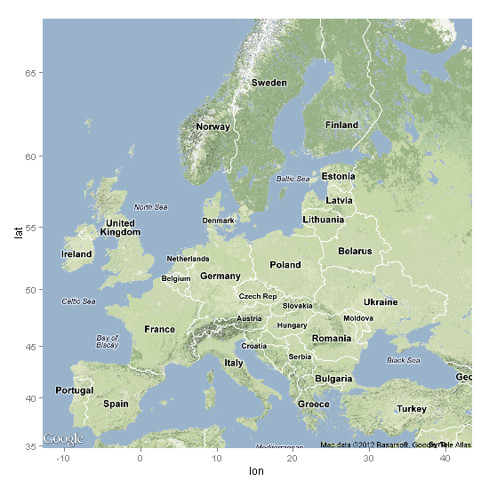
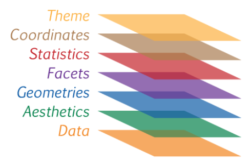
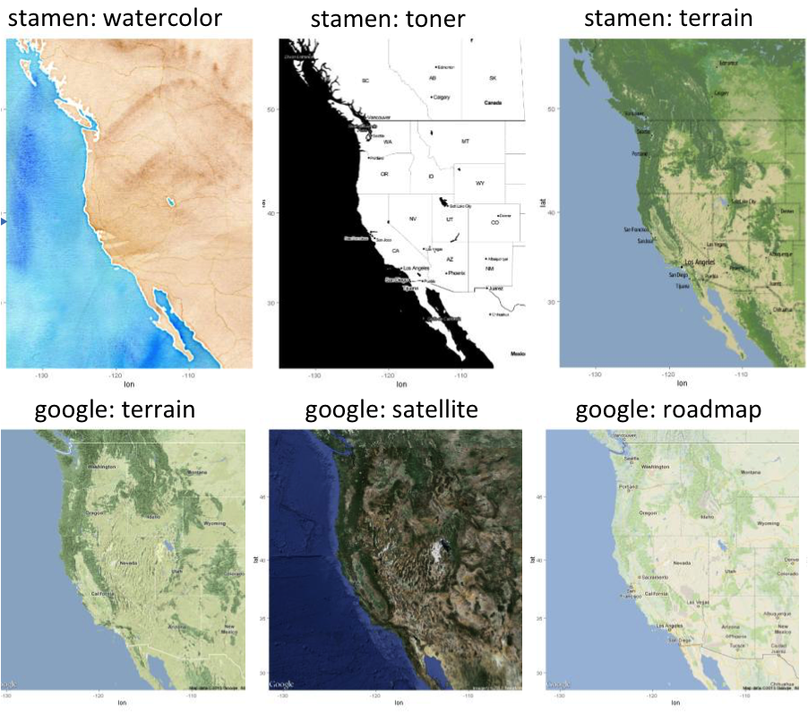

## Creating maps in R

- Spatial visualization with ggplot2
- Add data to a map
- Easy, consistent and modular framework for
spatial graphics and data analysis

***

.center[]

---
## Grammar of graphics (gg)

<br>
2 principles:
- distinct layers of graphical elements
- meaningful plots using aesthetic mapping

***

.center[]


---
## Graph elements

ggplot2 Cheatsheet: https://www.rstudio.com/wp-content/uploads/2015/03/ggplot2-cheatsheet.pdf

3 essentials:
- Data (what you collected, in the right format)
- Aesthetics (aes)
- Geometries (geom)


4 optionals:
- Facets
- Coordinates
- Themes
- Statistics

.pull-right-70[]


---
class: small-code
## Basic world map

```{r fig.height=4, fig.width=8, message=FALSE, warning=FALSE, basic_world_map, echo=T}
mapWorld <- ggplot () + 
  borders ("world",
          colour = "gray50",
          fill = "gray50")
print (mapWorld)
```


---
## Have geo-referenced data

Coral bleaching data from ReefBase http://www.reefbase.org
```{r, coral_data}
# Upload data
datCoral <- read.csv("./Data/CoralBleachingData.csv", row.names = 1)
# head (datCoral) #sanity check
# str (datCoral)
```

---
## Subset data based on bleaching events

```{r, bleaching_events}
levels (datCoral$bleaching_severity)

# Remove the category "No Bleaching" and "Severity Unknown"
datCoralSub <- datCoral[
  datCoral$bleaching_severity %in% c("Low","Medium","High"), ]

# Replace the factors in a different order than in alphabetic order
datCoralSub$bleaching_severity <- factor(
  datCoralSub$bleaching_severity,
  levels = levels(datCoralSub$bleaching_severity)[c(2,3,1)]
  ) 
```


---
## Add the data to the map

```{r, coral_data_to_map, fig.height=5, fig.width=10, echo=T}
mapCoral <- mapWorld + 
  geom_point (data = datCoralSub,
             aes(x = longitude,
                 y = latitude,
                 colour = bleaching_severity),
             alpha = 0.5)
print (mapCoral)
```


---
## Fine tuning: Adjusting colours

```{r, adjusting_colours, echo=T, fig.height=5, fig.width=10, warning=FALSE}
mapColour <- mapCoral +
  scale_colour_manual (values = c("Low" = "yellow",
                                  "Medium" = "orange",
                                  "High" = "red")) 

print(mapColour)
```


---
## Fine tuning: Facets

```{r, facets, fig.height=6, fig.width=10, echo=T}
mapFacets <- mapColour +
  facet_wrap (~ year)

print (mapFacets)
```


---
## Steps to create a map

1.	Have an idea: know what you want to visualize
2.	Get the map you need
3.	Get data that is geo-referenced (coordinates of places you want to show)
4.	Plot map and data together
5.	Customize: add extra visuals as you want
    -	Colors
    -	Facets
    -	Name of places
    - Path
    -	etc


---
## Functions

* <span style="color:red">get_map()</span>
    + get a map from somewhere
    + arguments: 
      - <span style="color:orange">*source*</span> (Google, Stamen, OpenStreetMap and CloudMade)
      - <span style="color:orange">*maptype*</span>
      - <span style="color:orange">*zoom*</span>

***

.center[]
  
---
## Functions

* <span style="color:red">get_map()</span>
    + get a map from somewhere
    + arguments: 
      - <span style="color:orange">*source*</span> (Google, Stamen, OpenStreetMap and CloudMade)
      - <span style="color:orange">*maptype*</span>
      - <span style="color:orange">*zoom*</span>
  
***
* <span style="color:red">ggmap()</span>
    + plot the map


---
## Functions

* <span style="color:red">get_map()</span>
    + get a map from somewhere
    + arguments: 
      - <span style="color:orange">*source*</span> (Google, Stamen, OpenStreetMap and CloudMade)
      - <span style="color:orange">*maptype*</span>
      - <span style="color:orange">*zoom*</span>
  
***
* <span style="color:red">ggmap()</span>
    + plot the map
* <span style="color:red">geocode()</span>
    + finds latitude and longitude of places

---
## Functions

* <span style="color:red">get_map()</span>
    + get a map from somewhere
    + arguments: 
      - <span style="color:orange">*source*</span> (Google, Stamen, OpenStreetMap and CloudMade)
      - <span style="color:orange">*maptype*</span>
      - <span style="color:orange">*zoom*</span>
  
***
* <span style="color:red">ggmap()</span>
    + plot the map
* <span style="color:red">geocode()</span>
    + finds latitude and longitude of places
* <span style="color:red">trek()</span>
    + finds coordinates for path between places


---
## Resources

Kahle, D., & Wickham, H. (2013). ggmap: Spatial Visualization with ggplot2. R Journal, 5(1).


---
## Resources

Kahle, D., & Wickham, H. (2013). ggmap: Spatial Visualization with ggplot2. R Journal, 5(1).

Chang, W. (2012). R graphics cookbook: practical recipes for visualizing data. " O'Reilly Media, Inc.".

.center[]

---
## Resources

Kahle, D., & Wickham, H. (2013). ggmap: Spatial Visualization with ggplot2. R Journal, 5(1).

Chang, W. (2012). R graphics cookbook: practical recipes for visualizing data. " O'Reilly Media, Inc.".

Cheatsheet:
https://www.nceas.ucsb.edu/~frazier/RSpatialGuides/ggmap/ggmapCheatsheet.pdf


---
## Libraries needed

Get the updated version of ggmap:
* https://github.com/dkahle/ggmap
* Author: David Kahle
  + Baylor University, Waco, Texas
  
.center[]

```{r, libraries, warning=FALSE}
#if(!requireNamespace("devtools")) install.packages("devtools")
#devtools::install_github("dkahle/ggmap", ref = "tidyup")
library (ggmap)
library (tidyverse)
```

???
Devtools: (developper tools) providing R functions that simplify many common tasks for package developping


---
## Exercise 1

Enter your API key in R with ggmap::register_google (key = "number")

---
## Exercise 1

Get the desired map

.pull-left-50[
```{r, get_SU_map1, message=FALSE, warning=FALSE, eval=FALSE}
# Get the map form source 
# Stockholm University recentered
su <- get_map (
  location = c(lon = 18.0590,
               lat = 59.3644),  
  source = "stamen",
  maptype = "terrain",
  zoom = 16, 
  crop = TRUE) 

# make the map into a 
# ggmap object to plot it
suMap <- ggmap(su,
   extent = "device")

# Visualise the map
print(suMap)
```
]

.pull-right-50[
```{r, get_SU_map2, fig.align="right", message=FALSE, warning=FALSE, eval=T, echo=F}
# Get the map form source (Stockholm University recentered)
su <- get_map (location = c(lon = 18.0590, lat = 59.3644),  
               source = "stamen",
               maptype = "terrain",
               zoom = 16, 
               crop = TRUE) 

# Make the map into a ggmap object to plot it
suMap <- ggmap(su,
   extent = "device")

# Visualise the map
print(suMap)
```
]


Note:
zoom between 3 (continent) to 21 (building), default value 10 (city)

---
## Exercise 1

Get the locations

(enable Geocoding API in the Google Console) 
```{r, tibble_of_locations1, message=FALSE, warning=FALSE}
# Create a tibble of SU's important locations
suLocations <- tibble(
  location = c("DEEP, Stockholm University",
               "Stockholm University Library",
               "Universitetet, Stockholm"))

# Get the geocode (lat/lon) of the locations
suCoord <- geocode(suLocations$location)

# Create a data frame of the data
# for easier plotting
suDat <- cbind(suLocations, suCoord)

suDat
```

---
## Exercise 1

Plot the locations

.pull-left-50[
```{r, plot_our_locations1, message=FALSE, warning=FALSE, eval=F}
# Plot important locations
suLocationsMap <- suMap +
  geom_point(data = suDat,
             aes(x = lon, y = lat),
             color = 'red',
             size = 5)

print (suLocationsMap)
```
]

.pull-right-50[
```{r, plot_our_locations2, fig.align="right", message=FALSE, warning=FALSE, echo=F}
# Plot important locations
suLocationsMap <- suMap +
  geom_point(data = suDat,
    aes(x = lon, y = lat),
    color = 'red', 
    size = 5)

print (suLocationsMap)
```
]

---
## Exercise 1

Add names of locations

.pull-left-50[
```{r, add_names1, message=FALSE, warning=FALSE, eval=F}
# Add name of places
suLocMapNames <- suLocationsMap +
  geom_text(data = suDat, 
            aes(label = location),
            size = 5,
            hjust = 0, 
            vjust = -1)

print (suLocMapNames)
```
]

.pull-right-50[
```{r, add_names2, fig.align="right", message=FALSE, warning=FALSE, eval=T, echo=F}
# Add name of places
suLocMapNames <- suLocationsMap +
  geom_text(data = suDat, 
            aes(label = location),
            size = 5,
            hjust = 0, 
            vjust = -1)

print (suLocMapNames)
```
]

---
##Exercise 1

Get the route 
(enable Directions API in the Google Console)

.pull-left-50[
```{r create route1, eval=F, message=FALSE, warning=FALSE}
# Create the route with trek()
# Deep to library
goto_library <- trek(
  from = "DEEP, Stockholm University",
  to = "Stockholm University Library",
  structure = "route",
  mode = "walking")

# Add route to map
deepToLibraryMap <- suLocMapNames +
  geom_path(data = goto_library,
            aes(x = lon, y = lat),
            colour = "blue",
            size = 1.5,
            alpha = .5,
            lineend = "round")

print (deepToLibraryMap)
```
]

.pull-right-50[
```{r create route2, echo=F, fig.align="right", message=FALSE, warning=FALSE}
# Create the route with trek()
# Deep to library
goto_library <- trek(
  from = "DEEP, Stockholm University",
  to = "Stockholm University Library",
  structure = "route",
  mode = "walking")

# Add route to map
deepToLibraryMap <- suLocMapNames +
  geom_path(data = goto_library,
            aes(x = lon, y = lat),
            colour = "blue",
            size = 1.5,
            alpha = .5,
            lineend = "round")

print (deepToLibraryMap)
```
]


---
##Exercise 1

Get the route 
(enable Directions API in the Google Console)

.pull-left-50[
```{r route3, eval=F, warning=FALSE}
# Library to t-bana station
goto_tbana <- trek(
  from = "Stockholm University Library",
  to = "Universitetet, Stockholm",
  structure = "route", 
  mode = "walking")

# Add route to map
LibraryToTbanaMap <- suLocMapNames +
  geom_path(data = goto_library,
            aes(x = lon, y = lat),
            colour = "blue",
            size = 1.5,
            alpha = .5,
            lineend = "round") +
  geom_path(data = goto_tbana,
            aes(x = lon, y = lat),
            colour = "blue",
            size = 1.5,
            alpha = .5,
            lineend = "round")

print (LibraryToTbanaMap)

```
]

.pull-right-50[
```{r echo=F, message=FALSE, warning=FALSE, route4, fig.align="right"}
# Library to t-bana station
goto_tbana <- trek(
  from = "Stockholm University Library",
  to = "Universitetet, Stockholm",
  structure = "route", 
  mode = "walking")

# Add route to map
LibraryToTbanaMap <- suLocMapNames +
  geom_path(data = goto_library,
            aes(x = lon, y = lat),
            colour = "blue",
            size = 1.5,
            alpha = .5,
            lineend = "round") +
  geom_path(data = goto_tbana,
            aes(x = lon, y = lat),
            colour = "blue",
            size = 1.5,
            alpha = .5,
            lineend = "round")

print (LibraryToTbanaMap)

```
]

---
## Exercise 2

Option local: Create a map of where you live, the closest metro station and your favorite coffee shop/restaurant/bar in town.

Option UK: Create a map of the pubs and bars in the town “Oldham”, UK
- info: https://nbisweden.github.io/RaukR-2018/ggmap_Sebastian/lab/ggmap_Sebastian.html#33_pubs
- data: https://github.com/deepskillsr/Data_for_Students

---
## For more

RaukR course: 
- https://nbisweden.github.io/workshop-RaukR-1806/programme/ (see ggmap by Sebastian DiLorenzo)

library (leaflet): open-source JavaScript libraries for interactive maps

---
name: end-slide
class: end-slide

# Thank you