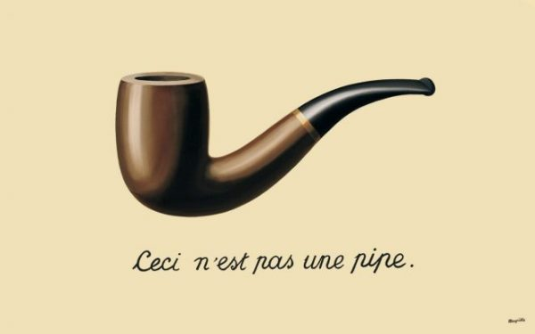

name: intro
class: spaced 

##Good coding practices

***
```{r,echo=FALSE,message=FALSE,warning=FALSE,results='hide'}
# run setup code

# load libraries ---------------------------------------------------------------
library(knitr)  # runs pandoc
library(bookdown)  # for markdown
library(captioner)  # for table and figure captions

suppressPackageStartupMessages(library(tidyverse))

# knitr options ----------------------------------------------------------------

knitr::opts_knit$set(progress=TRUE,verbose=TRUE)
knitr::opts_chunk$set(dev="CairoPNG",results="hold",fig.show="hold",fig.align="left",echo=TRUE,warning=FALSE,message=FALSE)
```

```{r,echo=FALSE,message=FALSE,warning=FALSE}
# load the packages you need

# library(tidyverse)
# library(ggplot2)  # static graphics
```

<br>
> "Let us change our traditional attitude to the construction of programs. Instead of imagining that our main task is to instruct a computer what to do, let us concentrate rather on explaining to human beings what we want a computer to do." - Donald E. Knuth, *Stanford University*

<br>
.center[]

???
Donald E. Knuth: Professor Emeritus at Stanford University. In 1962, he embarked on a monumental seven-volume work titled The Art of Computer Programming, which now occupies him full time. The four volumes released to date are available in nine languages with over one million copies printed. An R script isn’t just telling the computer how to perform calculations on your data. It is also explaining your work to other human beings.

---
name: intro1
## Why writing nicer code?

***
<br>
- easy to read
- easy to write 
- runs fast
- gives reliable results
- easy to reuse in new projects
- easy to share with collaborators

???
Mathilda, a colleague at DEEP: "My code is so messy, I feel it's very personal, it's like my dirty laundry, I don't want to share it with anybody." Well, what if your laundry is clean and neatly folded, would you mind as much? It's just like your code; it if is nicely written and tidy, it will be easy to share with collaborators.

---
name: intro2
## Why writing nicer code?

***
<br>
- easy to read
- easy to write 
- runs fast
- gives reliable results
- easy to reuse in new projects
- easy to share with collaborators
<br>
> "The single biggest reason you should write nice code is so that your future
self can understand it." - Greg Wilson *Software Carpentry Course*

.center[]

???
co-founder of Software Carpentry, a non-profit organization that teaches basic computing skills to researchers.

---
name:intro2
##Benefits of writing nicer code
***
<br>
- Better science 
<br>
- More fun 
<br>
- Become more efficient 
<br>
- Future employment 

???
- Better science: nice code allows you to handle bigger data sets and has less bugs.
- More fun: spend less time wrestling with R, and more time working with data.
- Become more efficient: Nice code is reusable, sharable, and quicker to run.
- Future employment: Professional data analysts take clarity very seriously. You should consider anything you write (open or closed) to be a potential advertisement to a future employer. Code has impact. Scientists with analytical skills are often sought-after in the natural sciences.

---
name:intro3
##General guidelines

- Organise your project and related materials
- Make different chunks for each task
- Care for your code by:
  + using comments
  + having meaningful variable or function names
  + apply a consistent style
- Use version control


???
Use version control: Of the many reasons for using version control, one is that it archives older versions of your code, permitting you to  safely delete old files. This helps reduce memory usage, messy files and improves readability.

---
name: good coding practices1
##Good coding practices

- Start your script with a header
    + name of project
    + short description
    + your name
    + the date your started the script
```{r header}
#####################################
# title: "Population dynamics of Lathyrus vernus project"
# subtitle: "Data cleaning"
# author: "Malie Lessard-Therrien"
# date: "02/10/2018"
#####################################
```

---
name: good coding practices2
##Good coding practices

- Start your script with a header
    + name of project
    + short description
    + your name
    + the date your started the script
```{r header2}
#####################################
# title: "Population dynamics of Lathyrus vernus project"
# subtitle: "Data cleaning"
# author: "Malie Lessard-Therrien"
# date: "02/10/2018"
#####################################
```

- Then libraries

```{r libraries}
library (xaringan)
library (tidyverse)
library (ggmap)  # geocode ()
```

???
Load packages at the beginning. If it's fairly self-evident why the package is needed, at least to you, just load and continue. If it's a specialty o package, then remind yourself what function(s) you are going to use; this way, you build your own knowledge about libraries out there.

---
name: Notation and naming1
##Notation and naming

A syntactically valid name:

- Consists of:

    + letters: `abcdefghijklmnopqrstuvwxyzABCDEFGHIJKLMNOPQRSTUVWXYZ`
    + digits: `0123456789`
    + period: `.`
    + underscore: `_`
    
- begins with a letter or the period (.) not followed by a number 
- **BUT: variable names beginning with period are hidden. Ex: `.my_secret_variable` will not be shown but can be accessed

- cannot be one of the *reserved words*: `if`, `else`, `repeat`, `while`, `function`, `for`, `in`, `next`, `break`, `TRUE`, `FALSE`, `NULL`, `Inf`, `NaN`, `NA`, `NA_integer_`, `NA_real_`, `NA_complex_`, `NA_character_`

- also cannot be: `c`, `q`, `t`, `C`, `D`, `I` because they already are objects

---
name: Notation and naming2
##Customary variable names

Also, there is a number of variable names that are traditionally used to name particular variables:

- `usr` -- user,
- `pwd` -- password,
- `x`, `y`, `z` -- vectors,
- `w` -- weights,
- `f`, `g` -- functions,
- `n` -- number of rows,
- `p` -- number of columns,
- `i`, `j`, `k` -- indexes,
- `df` -- data frame,
- `cnt` -- counter,
- `M`, `N`, `W` -- matrices,
- `tmp` -- temporary variables

Sometimes these are domain-specific:

- `p`, `q` -- allele frequencies in genetics,
- `N`, `k` -- number of trials and number of successes in stats 

Try to avoid use these in another way to avoid possible confusion.


---
name: Notation and naming3
##Notation and naming

Different notation styles:
- `snake_notation_looks_like_this`
- `camelNotationLooksLikeThis`
- `period.notation.looks.like.this` *generic functions in S3 classes
- `LousyNotation_looks.likeThis`

Which ever style you choose:
- use meaningful names, e.g. `genotypes` vs. `fsjht45jkhsdf4`
- be concise, e.g. `weight` vs. `phenotype_weight_measured`
- be consistent across your code, use the same naming convention


???
Variable and function names should be lowercase. Use `_` to separate words within a name. Generally, variable names should be nouns and function names should be verbs. Strive for concise but meaningful names (this is not easy!)

---
name: syntax1
##Syntax

Spacing

- Place spaces around all binary operators (=, +, -, <-, etc.)
```{r syntax spacing1, eval = FALSE}
# Good
average <- mean(speed / 12 + dist, na.rm = T)
# Bad
average<-mean(speed/12+dist,na.rm=T)
```


---
name: syntax2
##Syntax

Spacing

- place spaces around all binary operators (=, +, -, <-, etc.)
```{r syntax spacing2, eval = FALSE}
# Good
average <- mean(speed / 12 + dist, na.rm = T)
# Bad
average<-mean(speed/12+dist,na.rm=T)
```

- use brackets and commas like in written English
- place a space before left parenthesis, except in a function call.
```{r syntax brackets and comma, eval = FALSE}
# Good
if (debug)
plot(graph1)
diamonds[5, ]

# Bad
if ( debug )  # Don't add spaces around debug
plot (graph1)  # Don't add space before left parenthesis in a function call
x[1,]  # Add a space after the comma
x[1 ,]  # Add a space after the comma, not before
```

???
The square brackets are used to subset vectors and data frames.
Indexing: isolate particular entries items that meet some criteria

---
name: syntax3
##Syntax

Spacing

- Extra spacing (i.e., more than one space in a row) is acceptable if it improves alignment of equals signs or arrows (<-).

```{r eval = FALSE}
plot(x    = x.coord,
     y    = y.coord,
     ylim = ylim,
     xlab = "dates",
     ylab = metric,
     main = (paste(metric, " for 3 samples ", sep = "")))
```


---
name: syntax4
##Syntax

Curly Braces

An opening curly brace should not go on its own line.
A closing curly brace should always go on its own line.
Exception: An "else" statement should always be surrounded on the same line by curly braces.

```{r curly braces, eval = FALSE}
# Good
if (is.null(ylim)) {
  ylim <- c(0, 0.06)
}
if (condition) {
  one line
  or more lines
} else {
  one line
  or more lines
}
# Bad
if (is.null(ylim)) {ylim <- c(0, 0.06)}  # closing curly brace on its own line
if (condition) {
  one or more lines
}
else {              # surround "else" statement by curly braces
  one or more lines
}

```

???
The curly braces are used to denote a block of code in a function.

---
name: line length1
##Line length

For being concise and increase code readability, keep your lines up to 80 characters. 

```{r line length exceeded1, eval = FALSE}
# The following line displays which of your species have multiple matches in the synonyms of the dyntaxa table (that's the length(x)>1 part). Check through these to make sure that the first of the multiple answers is the right one. If not (like a hybrid or subspecies rather than the true synonym), we fix that below.
sapply(unique(obs$Species[is.na(obs$dyn.spe)]), function(x) dyn.species$species[grep(x,dyn.species$synonyms)])[sapply(sapply(unique(obs$Species[is.na(obs$dyn.spe)]), function(x) dyn.species$species[grep(x,dyn.species$synonyms)]),function(x) length(x)>1)] 

```

---
name: line length
##Line length

For being concise and increase code readability, keep your lines up to 80 characters. 

```{r line length exceeded2, eval = FALSE}
# The following line displays which of your species have multiple matches in the synonyms of the dyntaxa table (that's the length(x)>1 part). Check through these to make sure that the first of the multiple answers is the right one. If not (like a hybrid or subspecies rather than the true synonym), we fix that below.
sapply(unique(obs$Species[is.na(obs$dyn.spe)]), function(x) dyn.species$species[grep(x,dyn.species$synonyms)])[sapply(sapply(unique(obs$Species[is.na(obs$dyn.spe)]), function(x) dyn.species$species[grep(x,dyn.species$synonyms)]),function(x) length(x)>1)] 

```


Set up 80 characters limit:
- In RStudio, go to
```{r line length1, eval = FALSE}
Tools -> Global Options -> Code -> Display
```

- there is a checkbox option: 
```{r line length2, eval = FALSE}
[ ] Show margin
    Margin column [80]
```

Check this and you will see a margin drawn in the code editor at the desired column.

???
Lines up to 80 characters: This is the amount that will fit comfortably on a printed page at a reasonable size. If you find you are running out of room, this is probably an indication that you should encapsulate some of the work in a separate function or shorten your variable names.

---
name: indenting
##Indenting

When indenting your code, use spaces. Never use tabs or mix tabs and spaces.
- Use indenting when:
    * keeping to 80 characters rule


```{r indenting1, eval = FALSE}
## drop some observations and unused factor levels
lotrDat <-
  droplevels(subset(lotrDat,
                    !(Race %in% c("Gollum", "Ent", "Dead", "Nazgul"))))
```

  * to align inside a block delimited by curly braces
    
```{r indenting2, eval = FALSE}
jFun <- function(x) {
    estCoefs <- coef(lm(lifeExp ~ I(year - yearMin), x))
    names(estCoefs) <- c("intercept", "slope")
    return(estCoefs)
    }
```

???
Indent definition: start (a line of text) or position (a block of text) further from the margin than the main part of the text.
ex: "type a paragraph of text and indent the first line"
synonyms:	move to the right, move further from the margin, start in from the margin

---
name: comments
##Comments

Use comments to describe what your code is meant to do 
- Comment entire code chunks beginning with # and one space.
- Short comments inside the code can be placed after the code line preceded by two spaces, #, and then one space.

```{r using comments}
# Exploring the data set iris
head(iris, n = 10)  # see the 10 first rows (default is 6 rows)
str(iris)  # see the structure of the dataset
```

---
name: tidyverse1
##Tidyverse

The tidyverse is a collection of R packages designed for data science. The tidyverse packages share common principles and are designed to work well together.  https://www.tidyverse.org/
- readr: Read flat files (csv, tsv, fwf) into R
- tibble: A modern re-imagining of the data frame
- tidyr: Easily tidy data with spread and gather functions
- dplyr: A grammar of data manipulation
- ggplot2: An implementation of the Grammar of Graphics in R
- reprex: Render bits of R code for sharing, e.g., on GitHub or StackOverflow
- purrr: A functional programming toolkit for R
- forcats: Tools for working with categorical variables (factors)

.center[

]

???
Hadley Wickham is a statistician from New Zealand who is currently Chief Scientist at RStudio and an adjunct Professor of statistics at the University of Auckland, Stanford University, and Rice University.
Charlotte Wickham is part-time Assistant Professor of Statistics at Oregon State University, specialist in R training and course developer for Data Camp. She does R training and data science consulting. she loves cats and so named two of the tidyverse packages she name with cat related names (purrr and forcats).

---
name: tidyverse2
##Tidyverse

The tidyverse is a collection of R packages designed for data science. The tidyverse packages share common principles and are designed to work well together.  https://www.tidyverse.org/
- tidyr: Easily tidy data with spread and gather functions
- ggplot2: An implementation of the Grammar of Graphics in R
- dplyr: A grammar of data manipulation
- reprex: Render bits of R code for sharing, e.g., on GitHub or StackOverflow
- tibble: A modern re-imagining of the data frame
- readr: Read flat files (csv, tsv, fwf) into R
- purrr: A functional programming toolkit for R
- magrittr: Improve the readability of R code with the pipe

.center[]

???
René François Ghislain Magritte was a Belgian surrealist painter. Pour ce tableau qui suscita bien des questionnements, Magritte s’est justifié :
« La fameuse pipe, me l’a-t-on assez reprochée ! Et pourtant, pouvez-vous la bourrer ma pipe ? Non, n’est-ce pas, elle n’est qu’une représentation. Donc si j’avais écrit sous mon tableau « ceci est une pipe », j’aurais menti ! » C.Q.F.D.

---
name: pipe1
##Pipes

Good to use when;
- several steps to modify a vector or dataframe
- similar input and output


---
name: pipe2
##Pipes

Good to use when;
- several steps to modify a vector or dataframe
- similar input and output

Example:

In your dataset, you want to;
- Step 1. change column names
- Step 2. subset specific data
- Step 3. add another column

---
name: pipe4
##Pipes

In your dataset, you want to;
- Step 1. change column names
- Step 2. subset (or filter) specific data
- Step 3. add another column

Keyboard shortcut: **ctrl/cmnd + shift + m** (magrittr)

```{r iris pipe4, eval=F}
irisSepalSize <- iris %>%
    
```

---
name: pipe5
##Pipes

In your dataset, you want to;
- Step 1. change column names
- Step 2. subset (or filter) specific data
- Step 3. add another column

Keyboard shortcut: **ctrl/cmnd + shift + m** (magrittr)

```{r iris pipe5, eval=F}
irisSepalSize <- iris %>%
  rename(sepal_length = Sepal.Length,  # changes column names
         sepal_width  = Sepal.Width,
         petal_length = Petal.Length,
         petal_width  = Petal.Width,
         species      = Species) %>% 
```

---
name: pipe6
##Pipes

In your dataset, you want to;
- Step 1. change column names
- Step 2. subset (or filter) specific data
- Step 3. add another column

Keyboard shortcut: **ctrl/cmnd + shift + m** (magrittr)

```{r iris pipe6, eval=F}
irisSepalSize <- iris %>%
  rename(sepal_length = Sepal.Length,  # changes column names
         sepal_width  = Sepal.Width,
         petal_length = Petal.Length,
         petal_width  = Petal.Width,
         species      = Species) %>% 
  filter(species == "versicolor" &  # is similar to subset
         petal_length > 4.0) %>% 
  
```

---
name: pipe7
##Pipes

In your dataset, you want to;
- Step 1. change column names
- Step 2. subset (or filter) specific data
- Step 3. add another column

Keyboard shortcut: **ctrl/cmnd + shift + m** (magrittr)

```{r iris pipe7, eval=F}
irisSepalSize <- iris %>%
  rename(sepal_length = Sepal.Length,  # changes column names
         sepal_width  = Sepal.Width,
         petal_length = Petal.Length,
         petal_width  = Petal.Width,
         species      = Species) %>% 
  filter(species == "versicolor" &  # is similar to subset
         petal_length > 4.0) %>% 
  mutate(sepal_size = sepal_length * sepal_width)  # adds a column
```

---
name: pipe8
##Pipes

In your dataset, you want to;
- Step 1. change column names
- Step 2. subset (or filter) specific data
- Step 3. add another column

Keyboard shortcut: **ctrl/cmnd + shift + m** (magrittr)

```{r iris pipe8}
irisSepalSize <- iris %>%
  rename(sepal_length = Sepal.Length,  # changes column names
         sepal_width  = Sepal.Width,
         petal_length = Petal.Length,
         petal_width  = Petal.Width,
         species      = Species) %>% 
  filter(species == "versicolor" &  # is similar to subset
         petal_length > 4.0) %>% 
  mutate(sepal_size = sepal_length * sepal_width)  # adds a column

head(irisSepalSize, n = 3)  
```

???
Pipes work in a linear way by executing one step and overwriting an intermediate object


---
name: source
##Sources

- RaukR course: 
  * https://nbisweden.github.io/workshop-RaukR-1806/programme/ (see Best coding practices by Marcin Kierczak)
- Why nicer code: 
  * https://nicercode.github.io/blog/2013-04-05-why-nice-code/
- Google's R Style Guide: 
  * https://google.github.io/styleguide/Rguide.xml#comments
- Hadley Wickham's adaptation of the Google style: 
  * http://stat405.had.co.nz/r-style.html
- General good habits for coding:
  * https://www.stat.ubc.ca/~jenny/STAT545A/block19_codeFormattingOrganization.html#coding-style
- Pipes
  * https://r4ds.had.co.nz/pipes.html

???
Use common sense and BE CONSISTENT.

The point of having style guidelines is to have a common vocabulary of coding so people can concentrate on what you are saying, rather than on how you are saying it. If you are editing code, take a few minutes to look at the code in front of you and determine its style. If others use spaces around their "if" clauses, you should, too. If their comments have little boxes of stars around them, make your comments have little boxes of stars around them, too. There are global style rules so people know the vocabulary. But personal style is also important.

---
name: end-slide
class: end-slide

# Thank you
